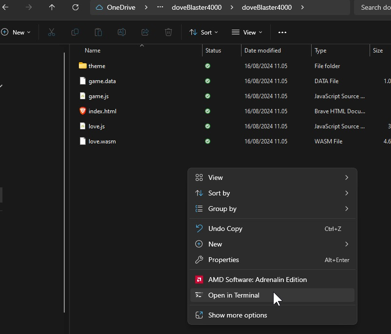
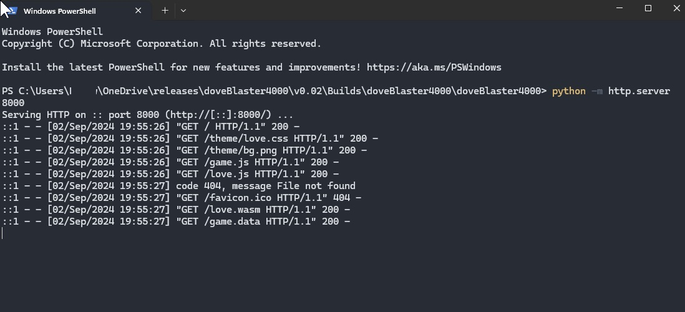
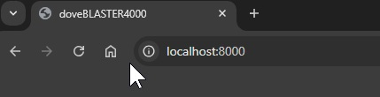

# inLove2d


## Templates for love2d project

This project aims to provide easy to dive into templates for starting various love2d projects wihtout having to reinvent the deep plate :D  

## Quick start
Copy content of desired sample folder etc "sample4_maid64_eventSystem" to the root folder of your project. 
If this was your project folder. Copy all content of sample4_maid64_eventSystem and paste it in inLove2d and replace everything, if there are existing files.  

FYI:  
sample4_maid64_eventSystem is the most mature setup

## Sample Overview
- UtillityFunctions
  - Helper functions, etc: colorpalettes
- sample2_eventSystem
  - base setup with eventSystem where you can publish/notify events and from desired place subscibe to event to trigger a action
- sample3_maid64_textbasic
  - maid64 scaling for pixel art projects, font is set to look nice to avoid blurred letters, base for text input, work well for textbased game/writing games
- sample4_maid64_eventSystem
  - maid64 scaling for pixel art projects, font is set to look nice to avoid blurred letters,, base setup with eventSystem where you can publish/notify events and from desired place subscibe to event to trigger a action

# How to setup Love2D in VSCode (Visual Studio Code) on Windows systems
Install [VSCode](https://code.visualstudio.com/)  

Install [LOVE2D](https://love2d.org/)  

Make sure Love2d is added to the path
### Add love2d to path for windows
windows key + env  

select path -> edit -> new -> add the love folder C:\Program Files\LOVE  


open cmd check if love is installed by writing  
love .  
or  
love --version  


Install these extensions in VS CODE
### Extensions 
Lua by Sumneko  

Love2D Support by Pixelbyte Studios

Local Lua Debugger by Tom Blind


### Print to termnial
windows
Make terminal prints work:  
Make a conf.lua file with the below in
REMEMBER TO SET conf.lua: 

```lua
function love.conf(t)
	t.console = true
end
```  

for mac:  
if you set t.console = true then a external terminal window will open

In the top of the main.lua file you need to add this, in order to make debugging in VS Code with breakpoints work :  
```lua
if arg[2] == "debug" then
    require("lldebugger").start()
end
```

## Build your game as HTML with loveJS
Script provided by:
All credits goes to abhimonk for the script!
Script provided by https://itch.io/profile/abhimonk via comment @ https://itch.io/post/10552214 itch page: https://abhimonk.itch.io/ x page: https://x.com/abhisundu

1. Place love_web_build.bat in your project folder
2. Install node.JS on your system:
   1. Open your terminal write::
   ```bat
    Winget install -e --id OpenJS.NodeJS
    ```
3. Install love.JS -> https://github.com/Davidobot/love.js/
   1. Open your terminal:
  ```bat
  npm i love.js
  ```
4. Install 7zip:
   1. Open terminal
  ```bat
  winget install -e --id 7zip.7zip
  ```
5. Edit the script file "love_web_build.bat": modify folders/files in the part 
   ```bat
   "....zipping up all files into %buildName%.zip"
   ```
   Ideally you put your main.lua in the root of your project and then you make everything else in a sub folder named src. Then you only need to include "src" "main.lua"
   ```bat
   echo zipping up all files into %buildName%.zip "C:\Program Files\7-Zip\7z.exe" a %buildFolder%/%buildName%/%buildName%.zip "src" "main.lua"
   ```
   it could also look like one of my projects:
   ```bat
   echo zipping up all files into %buildName%.zip "C:\Program Files\7-Zip\7z.exe" a %buildFolder%/%buildName%/%buildName%.zip "fonts" "sfx" "sprites" "UtillityFunctions" "collision.lua" "conf.lua" "enemy.lua" "event.lua" "gameManager.lua" "inputManager.lua" "maid64.lua" "maid64.png" "main.lua" "player.lua" "sfxManager.lua" "weapon.lua"
    ```

6. Double click the love_web_build.bat
   1. Enter the buildName when promted
   2. Enter the gameName when promted  
   3. ...Then the script will create a build folder in your project
   
7. Upload your game to itch.io
   1. upload your .zip file to itch from the build folder, and mark is file to be played as html, and then add "x" in SharedBufferArraryExport

8. Or test locally with a python webserver
   1. cd to the build folder and open the folder which are not zipped 
   2.  start python server (source: https://github.com/Davidobot/love.js/ under section: Test it)
        ```bat
        python -m http.server 8000
        ```
        
   3. Open any browser and go to: localhost:8000
      
    Now you can play your game locally
    
## Package dependencies/references in this projects
scaling:  
[maid64](https://github.com/adekto/maid64)

If you have contributions, please make a pull request ma dudes :)

fonts:
[m6x11](https://managore.itch.io/m6x11) By [Daniel Lissen](https://twitter.com/managore)  
  
[PixloidSans](https://ggbot.itch.io/pixeloid-font)


